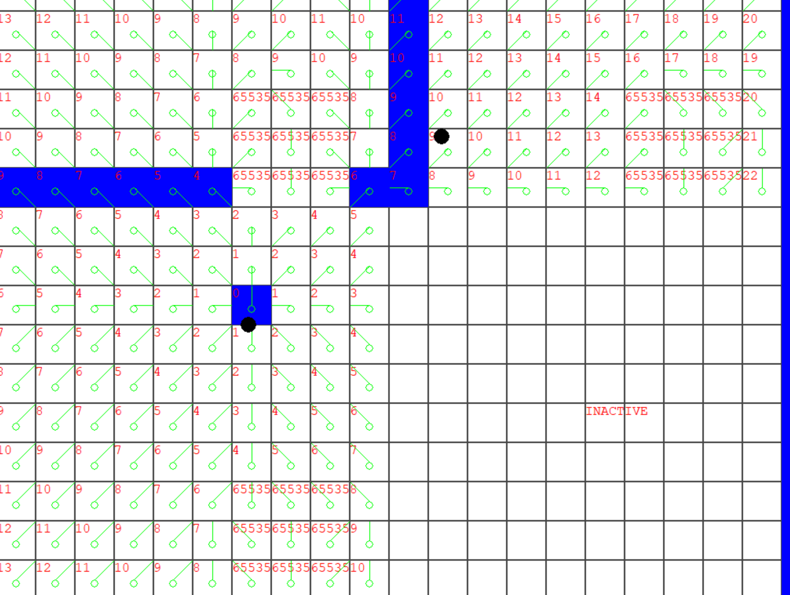

# 2D Flowfieds Research Project

Welcome to my Flowfield Pathfinding research project! This repository provides a comprehensive implementation of flowfield pathfinding in C++. Using the engine of our programming teachers, Kevin Hoefman developed. Flowfields offer a powerful and efficient solution for navigating many agents through complex environments with the same goal. I specifically researched flowfields for large maps in games but this could also be used for simulations,... 

## What is Flowfield Pathfinding?
Flowfield pathfinding is a technique that utilizes vectors stored in a grid to efficiently guide multiple agents through a given space. In contrast to traditional node-based methods, this approach creates a continuous, smooth flow across the environment, enabling agents to navigate seamlessly around obstacles or through varying terrain.

Flowfields are especially useful in games with many enemies where you would dynamically update the cost of travel since you only need to recalculate that sector/field specifically.


*Example of the result, displaying the integration, flowfield, and portalgraph using clear costfield.*

### Key Features of Flowfields
- Efficiency: Enjoy faster and more responsive pathfinding thanks to the continuous flowfield representation.
- Customizable Cost Factors: Allow users to customize and assign varying costs to different areas of the environment, giving them fine-grained control over pathfinding decisions.
  - Dynamic Obstacle Handling: Adapt to changes in the environment in real-time, with the flowfield updating dynamically to account for moving obstacles.
- Multi-Agent Coordination: Support coordination among multiple agents, allowing them to share information and collaboratively navigate through the environment while avoiding collisions.

## Flowfield Design And Implementation
To understand how the flowfield works for large maps, we first have to look at a single flowfield (or gridsector when we combine multiple smaller flowfields). Each flowfield or vector field is made up of 3 different fields or vectors. 

### Costfield
The first step to calculate a flowfield is to create a costfield. Each cell or index of the vector is represented by one byte so values range from 0-255, 1 being the default cost value and 255 being a wall or impassable cell. In a game you can use this cost for anything, a river, forest but also a village you would rather path around and so on. In my implementation, I have also included a static clear costfield that can be used by grid sectors where all values are 1 to save memory.

```cpp
std::vector<uint8_t> m_CostField;
static const std::vector<uint8_t> m_ClearCostField;
```


*Example of a randomized costfield.*

> [!NOTE]
> Whenever the costfield is modified the integrationfield and flowfield must be recalculated.

### Integrationfield
After creating the costfield we need to calculate the integrrationfield, using the previously created costfield. The integrationfield is a 16 bit field, you could make this a larger integer or float if the implementation requires it though. 

The commented vector is a an inttegration field which includes the possibility to add additional flags when you would optimize the implementation further. [See Future Work](#Future-work")

```cpp
//std::vector<std::pair<uint16_t, uint8_t>> m_IntegrationField;
std::vector<uint16_t> m_IntegrationField;
```
To calculate the integrationfield we take the costfield and integrate it outward. 


*Example of an inttegrationfield with a clear costfield.*

### Flowfield
Finally, the flowfield is calculated. The flowfield is an 8-bit field that stores the direction the agent would have to travel in.

```cpp
    //Lookup table for the directions
    enum class Directions
    {
        N = 0,
        NE = 1,
        E = 2,
        SE = 3,
        S = 4,
        SW = 5,
        W = 6,
        NW = 7,

        INVALID = 8
    };

std::vector<uint8_t> m_FlowField;
```

The flowfield is calculated by comparing all neighbors of each integrationfield cell one by one and storing the direction to the cheapest. 

### Combining multiple flowfields using A*
While you could just generate one very large flowfield for your game, this would not be efficient since you would need to update the whole map every time a new goal is set or any cost is updated. You would also be using a lot of resources that could be released. The solution to this is to combine multiple smaller flowfields, the references I used recommended 10x10 fields so that is what I have used in my implementation.

Each flowfield is a gridSector in my Grid class. and the different sectors are connected by portals, these portals are also nodes in a Graph. 

```cpp
struct Portal
{
	enum class PortalSide
	{
		LEFT,
		RIGHT,
		TOP,
		BOTTOM
	};

	Point2i portalPos;
	int portalId = - 1;

	std::vector<Point2i> FromFieldwindowPostions;
	std::vector<unsigned> toFieldWindowCellIdxes;

	unsigned toFieldId; 
	unsigned fromFieldId;
}
```

To select the correct flowfields to calculate, we first add the goal and source position to the graph and connect these with all the available portals. To make this step easier, All portals of a sector are stored in a vector of vectors, so the index of the sector matches the index of that portal vector. 


```cpp
    std::vector<std::unique_ptr<GridSector>> m_pGridSectors;
    std::vector<std::vector<Portal>> m_Portals; //For every gridsector, store a vector of all Portals in that grid
```

```cpp
void Grid::RequestPath(int sourceX, int sourceY, int goalX, int goalY) noexcept
{
	//Remove the previous goalNode if valid
	if (m_pGoalGraphNodeIdx != -1)
	{
		m_pGraph->RemoveNode(m_pGoalGraphNodeIdx);
	}

	if (m_SourceNodeIdx != -1)
	{
		m_pGraph->RemoveNode(m_SourceNodeIdx);
	}

	AStar astar{ m_pGraph.get() };

	//Add the goal as a node in the graph
	m_pGoalGraphNodeIdx = m_pGraph->AddNode(Point2i{ goalX, goalY });
	m_SourceNodeIdx = m_pGraph->AddNode(Point2i{ sourceX, sourceY });

	//Create connections with all portals of the gridsector for the goal
	for (const auto& p : m_Portals[m_GoalGridVecIdx])
	{
		m_pGraph->AddConnection(m_pGoalGraphNodeIdx, p.portalId);
	}

	//Create connections with all portals of the gridsector for the source
	for (const auto& p : m_Portals[m_SourceVecIdx])
	{
		m_pGraph->AddConnection(p.portalId, m_SourceNodeIdx);
	}

	m_pPath = astar.FindPath(m_pGraph->GetNode(m_pGoalGraphNodeIdx), m_pGraph->GetNode(m_SourceNodeIdx));
}
```

After connecting the goal and source, we run A* on the graph of portals and calculate the shortest path or the least amount of flowfields. This ensures that no unnecessary fields are calculated. 


*The portal Graphnodes, displaying how A Star is used on the portals, to select the correct sectors.*

Since we are now combining flowfields, this does require an extra step in our integration which is why the window indexes and positions are stored in the portal struct. We send this struct for every connection or portal integration and create the path in reverse, so start by calculating the goal grid, send the integrated windows to the next grid, and continue the calculation that way until the source position has been reached. 


*Displaying the graph and portals, the used windows for the calculation are displayed in blue.*

An extra check when integrating is also required to ignore walls when those are on the windows of this portal.


```cpp
for (size_t i{ 0 }; i < portal.toFieldWindowCellIdxes.size(); ++i)
{
	auto& pos{ portal.FromFieldwindowPostions[i] };
	unsigned index{ PositionToIdx(pos.x, pos.y) };

	if (m_CostField[index] != 255) //Do not push a wall on the integration
	{
		const auto integrateValue{ costFunction(portal.toFieldId, portal.toFieldWindowCellIdxes[i]) };

		if (integrateValue != UINT16_MAX)
		{
			m_IntegrationField[index] = integrateValue + 1;
			openList.emplace_back(index);
		}
		m_GoalList.emplace_back(index); //Still act as if portal even when blocked by wall; allows diagonal pathing
	}
}
```



*Including walls*

Now that we have a path of the gridsectors and know how we can integrate them using the other sectors, all that's left is going over the returned path sector indexes one by and using the previous sectors portal and Freeing the resources of all other sectors.

```cpp
int id{ -1 };
std::vector<Portal> portals;

auto it{ std::find_if(cbegin(m_Portals[m_SourceVecIdx]), cend(m_Portals[m_SourceVecIdx]), [this](const Portal& p) { return p.portalId == m_pPath[1]->GetId(); }) };
assert(it != end(m_Portals[m_SourceVecIdx]));

const auto& portal{ *it };

id = portal.toFieldId;

portals.emplace_back(portal);

int pathidx{ 1 };
while (id != m_GoalGridVecIdx)
{
	++pathidx;
	it = std::find_if(cbegin(m_Portals[portal.toFieldId]), cend(m_Portals[portal.toFieldId]), [pathidx, this](const Portal& p) { return p.portalId == m_pPath[pathidx]->GetId(); });
	portals.emplace_back(*it);

	id = it->toFieldId;
}

for (auto portalIt{ rbegin(portals) }; portalIt != rend(portals); ++portalIt)
{
	m_pGridSectors[(*portalIt).fromFieldId]->LoadSector();
	activeGridIdxes.emplace_back((*portalIt).fromFieldId);

	m_pGridSectors[(*portalIt).fromFieldId]->CalculateFlowField(*portalIt, m_CostFunction);
}

m_RecalculateGrid = false;

ResetFields(activeGridIdxes);
```


## Conclusion / Future work <a name="Future-work"></a>
Flowfields are a very powerful pathfinding tool and can be used for much more than you would think at first sight by adapting the algorithm. My implementation is not the most optimal and I will continue improving this implementation in the future in various ways.

### Adding a line of sight pass
In the future I would like to add a line of sight pass to reduce the need for calculations /  use of the field when possible.


*Line of sight pass used by one of my references*

### Adding an editor for the costfield
Adding an editor for the costfield and storing these maps as a file would allow me to fully display the power of flowfields in the future.

### Using a merging A* algorithm
The current implementation only works with one source grid, this is not optimal for very large maps, fixing this would require a modification of the A* algorithm that merges the different portal paths.

## References 
Leifnode. (2013, December). Flow Field Pathfinding. [Link](https://leifnode.com/2013/12/flow-field-pathfinding/)

Uber Entertainment. (2013). Flow Field Pathfinding in a 3D game implementation [Video](https://www.youtube.com/watch?v=5Qyl7h7D1Q8&t=1468s)

van Verth, J. M. (2013). Crowd Pathfinding and Steering Using Flow Field Tiles. In S. Rabin (Ed.), Game AI Pro (pp. 315-332). CRC Press. [Link](https://www.gameaipro.com/GameAIPro/GameAIPro_Chapter23_Crowd_Pathfinding_and_Steering_Using_Flow_Field_Tiles.pdf)

Howest. (2024). Graph Theory and A*.
